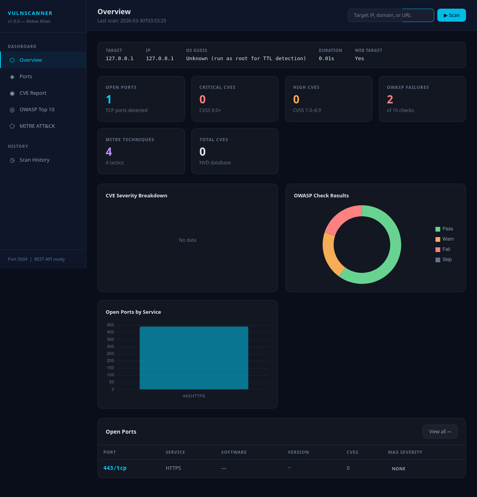

# Vulnerability Assessment Scanner

A Python-based vulnerability assessment tool that performs automated,
multi-layer security scanning against any IP address, domain, URL, or subnet.
Results are delivered through a real-time Flask SOC dashboard.



## Features

- Layer 1 — Port Discovery: Top 1000 TCP ports with concurrent threading
- Layer 2 — Service Fingerprinting: OS detection, banner grabbing, version extraction
- Layer 3 — CVE Enrichment: Real CVEs from NIST NVD API with CVSS severity scores
- Layer 4 — OWASP Top 10: All 10 categories checked against web targets (2021 edition)
- Layer 5 — MITRE ATT&CK: Findings mapped to tactics and techniques
- SOC Dashboard: Dark glassmorphism theme, Chart.js charts, real-time SocketIO updates
- REST API: Full API for ShieldLog SIEM integration

## Dashboard Pages

- Overview — scan summary, severity charts, quick stats
- Ports — full port table with service and version detail
- CVE Report — all CVEs sorted by severity with CVSS scores
- OWASP Top 10 — per-category results with findings
- MITRE ATT&CK — technique cards grouped by tactic
- Scan History — all past scans recorded automatically

## Installation
```bash
git clone https://github.com/cod735/vuln-scanner
cd vuln-scanner
bash install.sh
```

Add your free NVD API key to `config/.env`:
```
NVD_API_KEY=your_key_here
```

Get a free key at: https://nvd.nist.gov/developers/request-an-api-key

## Usage
```bash
source venv/bin/activate

# Full scan
python main.py 192.168.1.1

# Skip CVE lookup (faster)
python main.py example.com --skip-cve

# Specific ports only
python main.py 192.168.1.1 --ports 22,80,443

# Scan without launching dashboard
python main.py 192.168.1.1 --no-dashboard
```

## Dashboard
```bash
python dashboard/app.py
```

Open: http://localhost:5004

## REST API

| Endpoint | Method | Description |
|---|---|---|
| /api/summary | GET | High-level scan stats |
| /api/ports | GET | Open ports and services |
| /api/cves | GET | CVEs with CVSS scores |
| /api/owasp | GET | OWASP Top 10 results |
| /api/mitre | GET | MITRE ATT&CK mapping |
| /api/history | GET | All past scans |
| /api/scan/start | POST | Trigger a new scan |

## Tech Stack

Python 3.12, Flask, Flask-SocketIO, Eventlet, Chart.js,
NIST NVD API, python-dotenv, Requests, SQLite

## Portfolio

This is Project 5 of a unified security platform:

| Tool | Port | Description |
|---|---|---|
| ShieldLog SIEM | 5000 | Real-time SIEM with MITRE ATT&CK detection |
| PacketSentinel | 5001 | Network traffic monitor with GeoIP enrichment |
| SysVigilant | 5002 | File integrity monitor with VirusTotal integration |
| Honeypot System | 5003 | Cowrie SSH honeypot with AbuseIPDB enrichment |
| Vulnerability Scanner | 5004 | This tool |

## Developer

Abbas Khan — github.com/cod735

## License

MIT